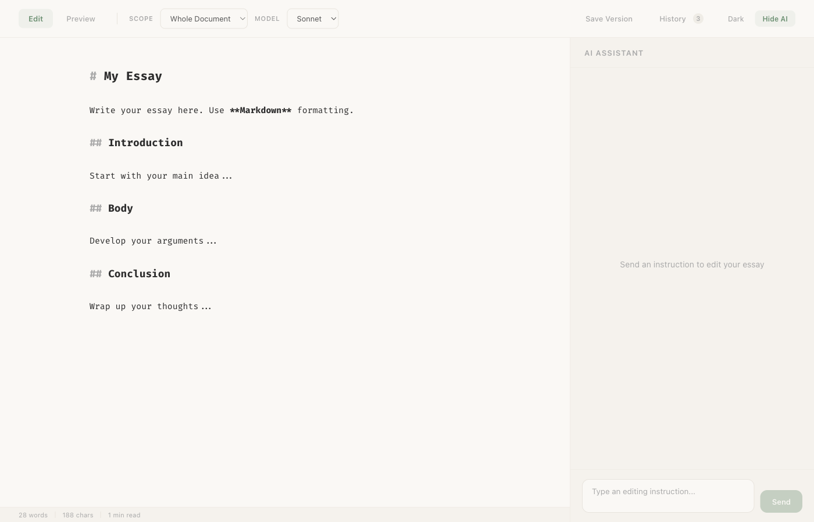
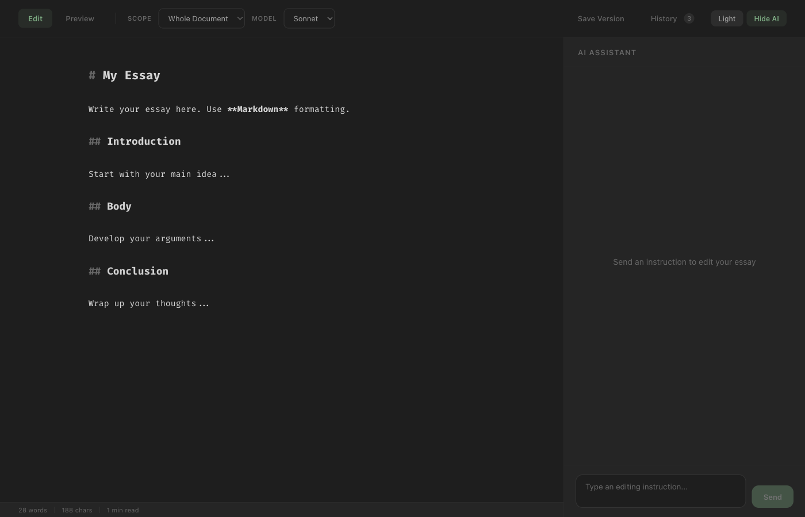
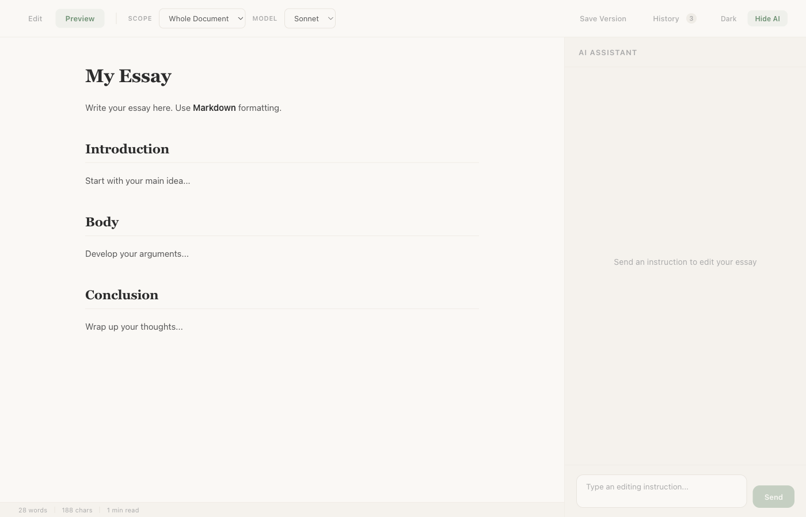

# Essay Editor

An AI-powered Markdown essay editor built with React and the Claude Code SDK. Write in a CodeMirror editor, get AI editing suggestions streamed in real-time, and review changes in a side-by-side diff view before accepting them.



## Features

- **CodeMirror 6 editor** with Markdown syntax highlighting and inline formatting
- **AI-assisted editing** via Claude (Sonnet, Opus, or Haiku) streamed over SSE
- **Multiple editing scopes** — edit the whole document, specific sections, or text selections
- **Chat mode** — conversational AI assistant for brainstorming and questions
- **Diff view** — review proposed AI changes side-by-side before accepting or rejecting
- **Markdown preview** — rendered preview with GFM support
- **Version history** — save snapshots and restore previous versions (localStorage)
- **Dark mode** — toggle between light and dark themes
- **Status bar** — live word count, character count, and reading time

### Dark Mode



### Markdown Preview



## Tech Stack

| Layer    | Technology                                            |
| -------- | ----------------------------------------------------- |
| Frontend | React 19, TypeScript, Vite, CodeMirror 6              |
| Backend  | Express 5, TypeScript, tsx                             |
| AI       | `@anthropic-ai/claude-code` SDK                       |
| Diff     | `diff` + `react-diff-viewer-continued`                |
| Markdown | `react-markdown` + `remark-gfm`                       |
| Monorepo | npm workspaces                                        |

## Project Structure

```
essayEditor/
├── client/                    # React frontend
│   └── src/
│       ├── components/
│       │   ├── Chat/          # AI chat panel
│       │   ├── DiffView/      # Side-by-side diff viewer
│       │   ├── EditBuilder/   # Multi-target edit UI
│       │   ├── Editor/        # CodeMirror integration
│       │   ├── Preview/       # Markdown preview
│       │   ├── SectionList/   # Section navigator
│       │   ├── StatusBar/     # Word/char count
│       │   └── Toolbar/       # Top toolbar
│       ├── hooks/             # useAIEdit, useVersionHistory, useSections
│       ├── services/          # API client (SSE)
│       ├── utils/             # Markdown parsing, hashing
│       └── types/             # TypeScript interfaces
├── server/                    # Express backend
│   └── src/
│       ├── routes/            # /api/edit, /api/versions
│       ├── services/          # Claude SDK wrapper
│       └── utils/             # Prompt builder
└── package.json               # Workspace root
```

## Prerequisites

- Node.js 18+
- [Claude CLI](https://docs.anthropic.com/en/docs/claude-code) installed and authenticated (`claude` must be available on PATH)

## Getting Started

```bash
# Install dependencies
npm install

# Start both client and server in dev mode
npm run dev
```

This launches:
- **Client** at `http://localhost:5173` (Vite)
- **Server** at `http://localhost:3001` (Express)

The Vite dev server proxies `/api` requests to the Express backend.

## Usage

1. **Write** your essay in the Markdown editor
2. **Choose a scope** — Whole Document, Section, or Selection
3. **Type an instruction** in the AI panel (e.g., "Make the introduction more engaging")
4. **Review** the proposed changes in the diff view
5. **Accept** or **reject** the changes
6. **Save versions** with `Cmd+S` to preserve snapshots

### Keyboard Shortcuts

| Shortcut    | Action            |
| ----------- | ----------------- |
| `Cmd+S`     | Save version      |
| `Escape`    | Toggle AI sidebar |

## License

MIT
